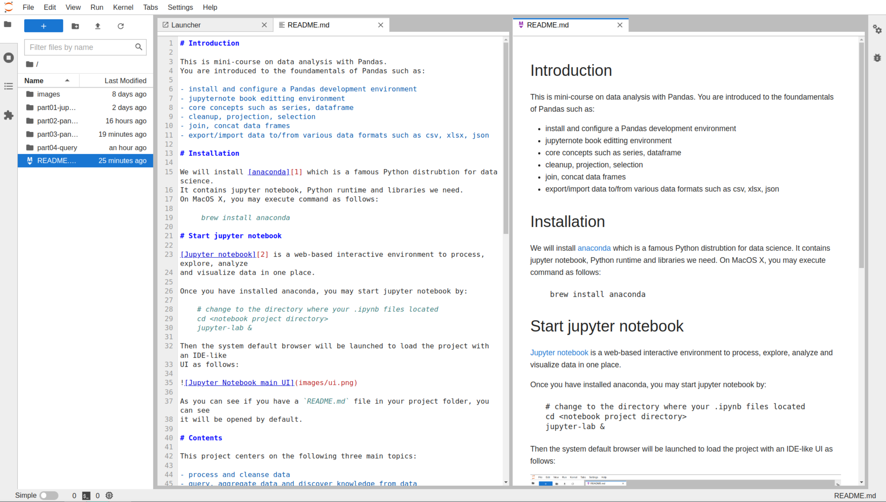

# Introduction

This is mini-course on data analysis with Pandas.
You are introduced to the foundamentals of Pandas such as:

- install and configure a Pandas development environment
- jupyternote book editting environment
- core concepts such as series, dataframe
- cleanup, projection, selection
- join, concat data frames
- export/import data to/from various data formats such as csv, xlsx, json

# Installation

We will install [anaconda][1] which is a famous Python distrubtion for data science.
It contains jupyter notebook, Python runtime and libraries we need.
On MacOS X, you may execute command as follows:

     brew install anaconda

# Start jupyter notebook

[Jupyter notebook][2] is a web-based interactive environment to process, explore, analyze
and visualize data in one place.

Once you have installed anaconda, you may start jupyter notebook by:

    # change to the directory where your .ipynb files located
    cd <notebook project directory>
    jupyter-lab &

Then the system default browser will be launched to load the project with an IDE-like
UI as follows:

As you can see if you have a `README.md` file in your project folder, you can see
it will be opened by default.

# Contents

This project centers on the following three main topics:

- process and cleanse data
- query, aggregate data and discover knowledge from data
- visualize data

This project consists of follows parts:

| part no |  sub-folder            |          description                  |
| ------- | ---------------------- | ------------------------------------- |
|   01    |  part-01-jupyter       |  explains environment setup           |
|   02    |  part-02-pandas-tour   |  brief intro w/ an example            |
|   03    |  part-03-pandas-basic  |  basics of DataFrame                  |
|   04    |  part-04-query         |  query data w/ multiple criteria      |
|   05    |  part-05-cleanse       |  cleanse and process data             |
|   06    |  part-06-multiindex    |  high-dimensional data example        |
|   07    |  part-07-aggregation   |  aggregration and apply example       |
|   08    |  part-08-merge         |  use merge and concat to combine data |

[1]: https://www.anaconda.com/products/distribution
[2]: https://jupyter.org
